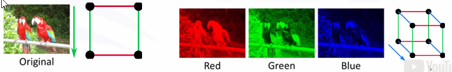

# Deep Learning

Tool used extensively in Deep Learning is Tensorflow.

### TensorFlow:

- Heavy numerical computations
- Based on Data Flow Graphs
- TensorFlow can run on small devices too(android, ios, ).

### What is a Data Flow Graph?

- Nodes: Matematical Operations
- Edges: Mutli-Dimensional Arrays (Tensors).
- Standard usage: BUILD >> EXEC

### What is the meaning of tensors?

Different variables can be represented as different dimensions.

A Image might have variables & properties such as height, width, hue, saturation, etc.

### Computation Graph Ingredients

Basically, y=mx+b,

where, m= Weight Matrix, x= Feature Matrix, b= Bias Terms

